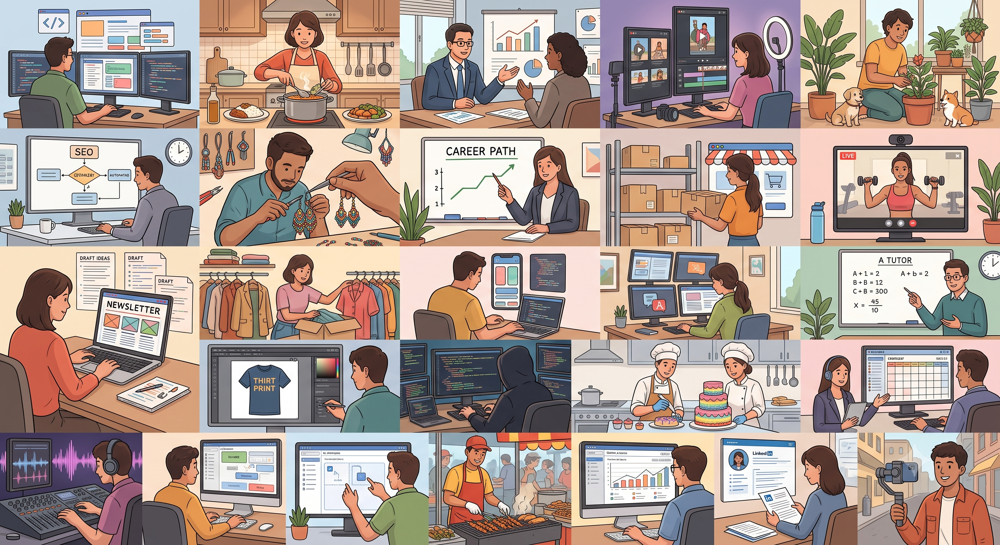

# 🚀 ZUNO — The Next-Generation Talent & Hiring Ecosystem

  
  <h3>Bridging Ambitious Builders & High-Growth Companies Through Proof of Work</h3>
  
<strong>A unified platform for top-tier campus talent and forward-thinking partner employers.</strong>

---

## 🌟 The Zuno Vision

Traditional hiring is broken—buried in generic resumes, endless recruiters, and opaque evaluation pipelines. 

**Zuno** reimagines talent acquisition by replacing resume noise with **verified proof-of-work credentials**, **transparent compensation**, and **real-time FIFO application pipelines**. We empower the next generation of engineers, creators, and designers to land impactful opportunities while providing partner companies with frictionless, one-click hiring.

---

## 🎯 Exclusively Built For

### 👨‍💻 1. For Candidates & Campus Builders
Zuno is exclusively crafted for driven student developers, creators, designers, and domain specialists who want:
- **Verified Identity & Profile**: Showcase academic credentials, GitHub repositories, LeetCode ratings, portfolio links, and skill clouds in one executive profile.
- **High-Impact Curated Opportunities**: Direct access to paid internships, fellowships, and full-time roles at top venture-backed startups and growth firms.
- **Real-Time Application Tracking**: Dynamic multi-stage application pipeline (Applied ➔ Under Review ➔ Shortlisted ➔ Offer Extended) with instant status updates.
- **Financial Transparency**: Live tracking of verified milestones, earnings, and monthly stipends.

### 🏢 2. For Partner Employers & Talent Leaders
Zuno equips hiring teams, founders, and recruiters with an enterprise-grade portal:
- **Live Hiring Analytics**: Real-time dashboard tracking Active Postings, Total Hires, Shortlisted Talent, and Declined Submissions.
- **Strict FIFO Candidate Pipeline**: Review applicants in chronological order of submission to ensure zero qualified talent is overlooked.
- **Executive PDF Resume Viewer**: One-click deep-dive into candidate profiles with centered name headers, contact bars, academic timeline, and portfolio links.
- **One-Click Hiring Decisions**: Instant **✓ Shortlist**, **✕ Reject**, or **⚡ Hire** candidate actions with optional recruiter contact sharing.

---

## ⚡ Core Features

### 📊 Partner Dashboard (/partner.html)
- **6-Metric Real-Time Analytics**: Dynamic metrics calculating live database numbers without static placeholders.
- **Opportunity Management**: Create and manage job openings with stipend ranges, responsibilities, and skill tags.
- **Floating Applicant Pipeline**: Interactive modal displaying candidate snapshots in FIFO order.
- **Candidate Evaluation Modal**: High-fidelity structured resume view with verified project links and recruiter details sharing.

### 💼 Candidate Dashboard (/dashboard.html)
- **Profile Customizer**: Modular profile manager with editable fields for education, branch, college, skills, and social handles.
- **Searchable Goals & Skills**: Interactive multi-select tags picker for career goals and domain specializations.
- **Opportunity Discovery**: Filter opportunities by category (Software, Video Editing, UI/UX, IT/DevOps) and location.
- **One-Click Direct Apply**: Instant application submission streaming directly to the partner portal.

### 🔄 Unified Real-Time Sync (pi.js)
- **Bi-Directional State Sync**: Instant cross-tab and cross-portal updates via unified event buses.
- **Supabase Cloud Database**: Persistent PostgreSQL backend with automatic client-side offline resilience.

---

## 🛠️ Architecture & Tech Stack

`mermaid
graph TD
    A[Frontend: Candidate Portal /dashboard.html] <--> C[Unified API Layer: api.js]
    B[Frontend: Partner Platform /partner.html] <--> C
    C <--> D[(Supabase Cloud Database - PostgreSQL)]
    C <--> E[Local Storage Datastore - Offline Fallback]
    F[Backend: Spring Boot Microservices] <--> D
`

- **Frontend**: Vanilla ES6+ JavaScript, Semantic HTML5, Modular CSS Design System (Luxury Minimalist Aesthetic).
- **Database**: Supabase PostgreSQL Cloud Database (profiles, opportunities, pplications).
- **Backend Services**: Java 17, Spring Boot, Spring MVC REST Controllers, Maven.
- **Real-Time Sync**: Storage Events, Custom Dispatchers, Supabase Realtime Channels.

---

## 🚀 Quickstart & Setup

### Prerequisites
- Python 3.x (for static server) OR Java 17+ and Maven (for Spring Boot backend).

### Running the Static Platform
`ash
# Clone the repository
git clone https://github.com/shdileep/Zuno.git
cd Zuno

# Start local server
python -m http.server 8080
`
- **Candidate Dashboard**: http://localhost:8080/dashboard.html
- **Partner Platform**: http://localhost:8080/partner.html
- **Landing Page**: http://localhost:8080/index.html

### Running the Spring Boot Backend
`ash
# Build and run with Maven
mvn clean spring-boot:run
`

---

## 📄 License & Ownership
Copyright © 2026 Zuno Network. Built with precision for builders and partner employers.
